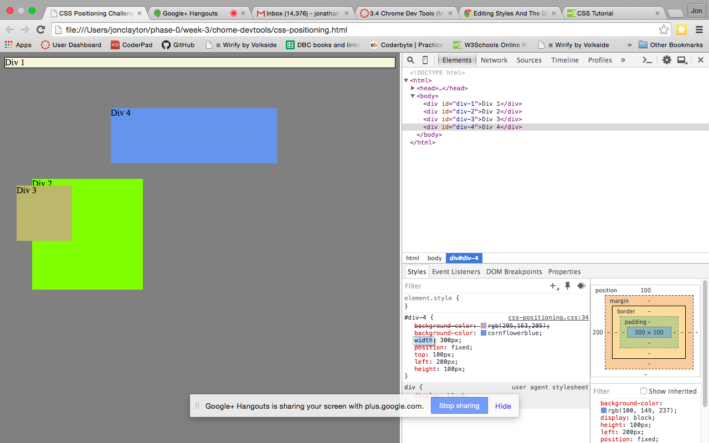
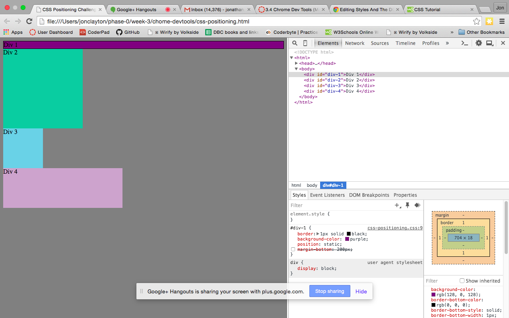
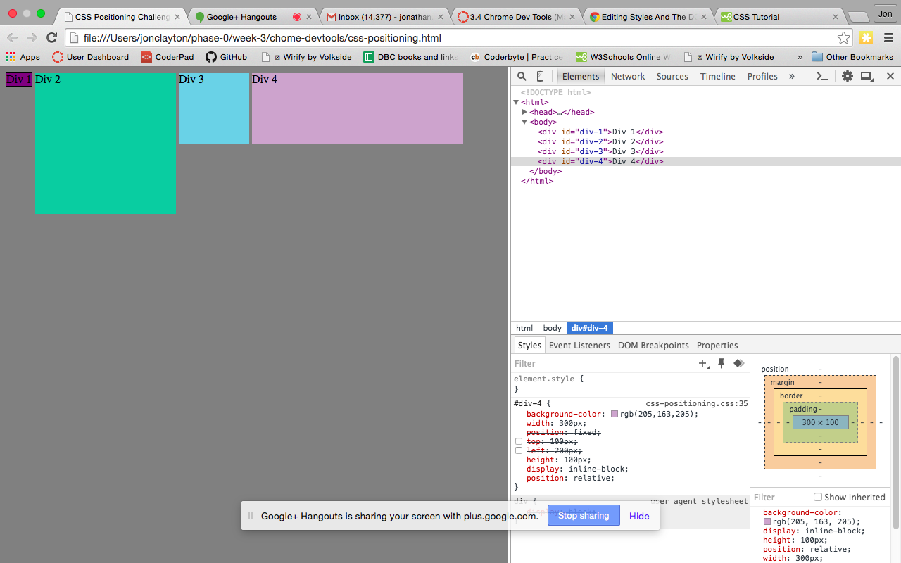
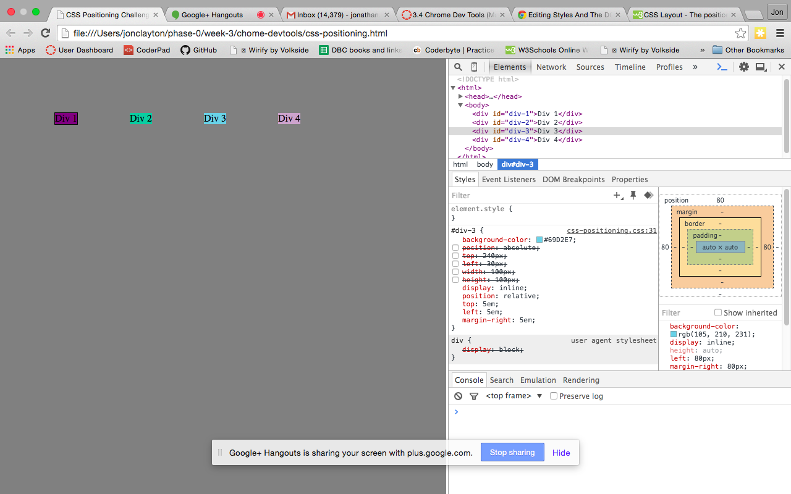
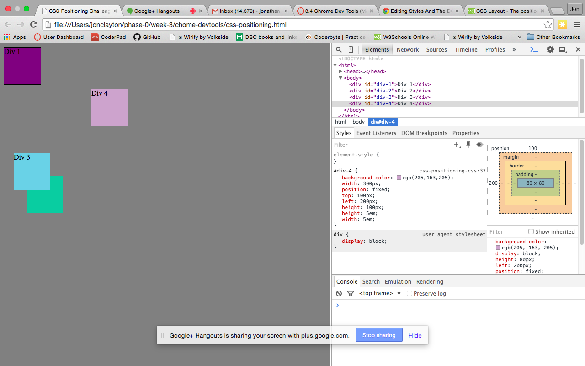
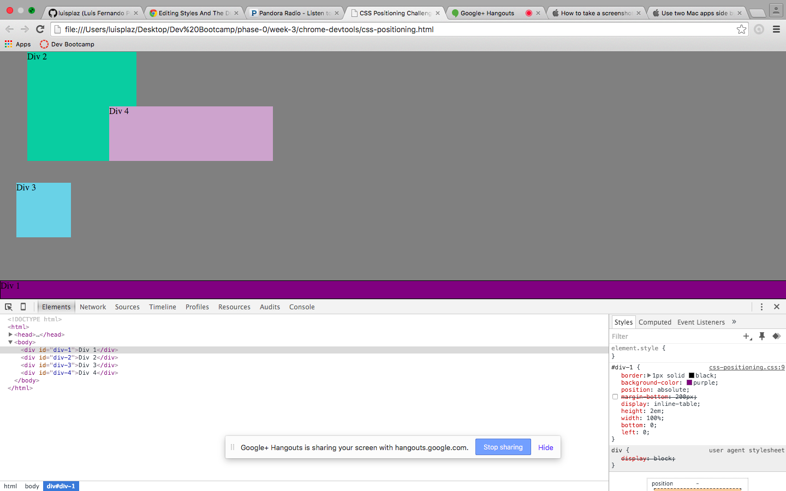
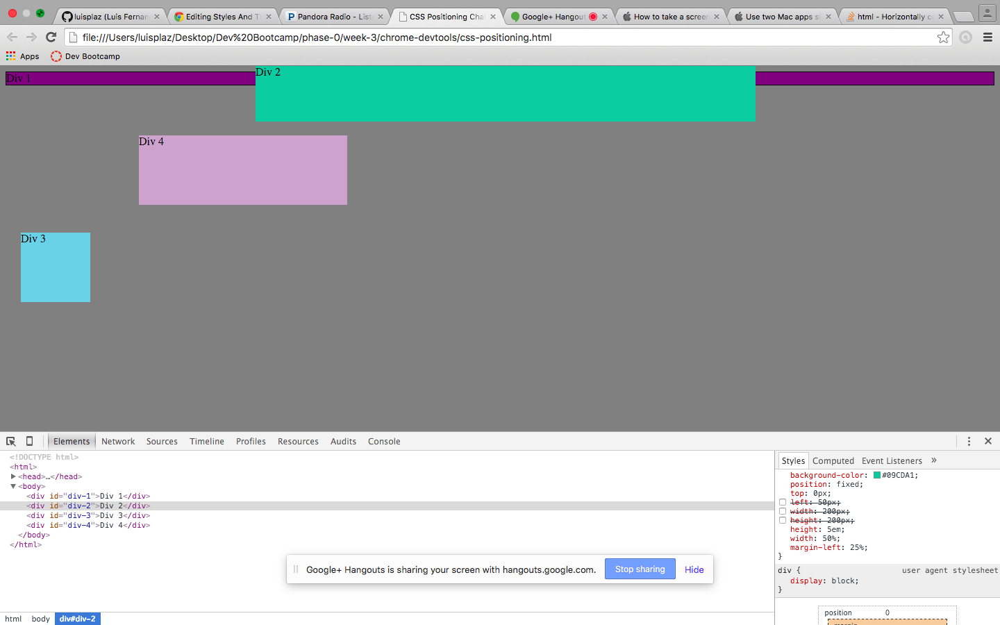
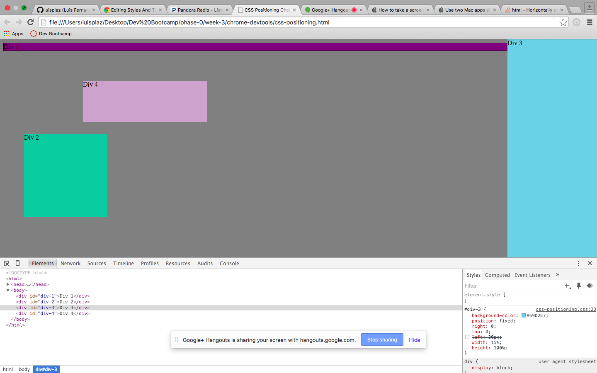
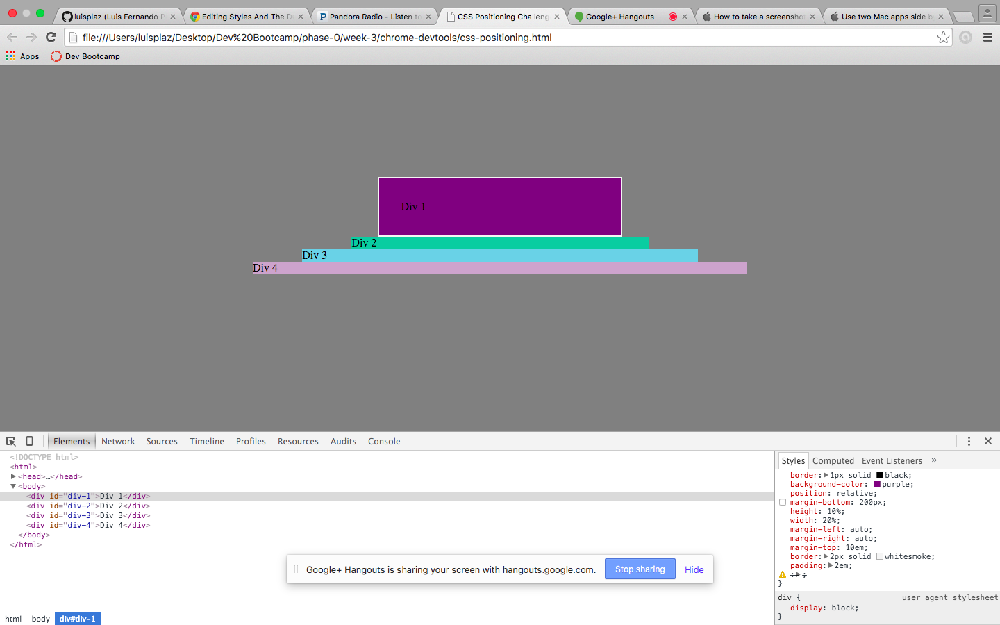

How can you use Chrome's DevTools inspector to help you format or position elements?

Well, you can use devtools to review how your website elements would look if you removed certain format or added format without having to change your master code. So you get to play around with the formatting of your elements.

How can you resize elements on the DOM using CSS?

On DOM you can overide prewritten code by writing ne one on the selected element details. You can add new height, width, etc and this will modify the dimensions of the element.

What are the differences between Absolute, Fixed, Static, and Relative positioning? Which did you find easiest to use? Which was most difficult?

Absolute: Positions element in relation to first non static parent it has.
Fixed: Anchors element relative to browser window. It stays there even if scrolling is done.
Static:Its the default position all elements have once added in browser window.
Relative:Positions element relative to where it is normally located.

What are the differences between Margin, Border, and Padding?

Margin is the space outside the border of the box content, the border is the actual edge of the box content and outside elements and the padding is the space inside the edges between the box content and the border.

What was your impression of this challenge overall? (love, hate, and why?)

It was very interesting to play around with the DOM and finally see with live examples what some of the formatting code did.

